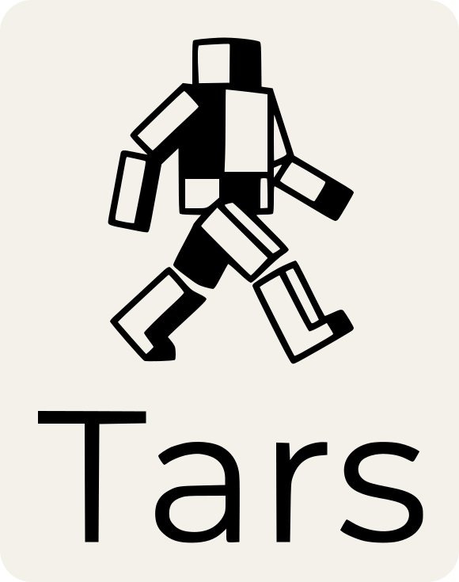

<h1 align="center">
  
</h1>

<p align="center">
  Experimental neural networks in Rust.<br />
  A standalone dot-product prototype in SystemVerilog.
</p>

<p align="center">
  <a href="#requirements">Getting started</a> &middot;
  <a href="#rust">Rust</a> &middot;
  <a href="#systemverilog">SystemVerilog</a> &middot;
  <a href="#documentation">Documentation</a>
</p>

---

`tars` is an experimental neural-network implementation written in Rust alongside a
standalone SystemVerilog dot-product prototype. The Rust code provides dense layers,
ReLU and sigmoid activations, sequential model composition, mean squared error,
finite-difference gradients, and batch gradient descent.

The Rust and SystemVerilog implementations are not currently integrated. In
particular, the Rust weight output uses IEEE-754 bit patterns while the NPU performs
signed integer arithmetic.

## Requirements

The Nix flake defines development shells for `x86_64-linux`:

```bash
nix develop             # Rust, NPU, Nix, and visualization tools
nix develop .#rust      # Rust and visualization tools
nix develop .#hardware  # Icarus Verilog, Verilator, GTKWave, and Verible
```

Without Nix, install a Rust 2024 toolchain and the system dependencies required by
`plotters`. Graphviz is required by the visualization prototype. The NPU commands
require GNU Make, Icarus Verilog, Verilator, and GTKWave as applicable.

## Rust

```bash
cargo build
cargo run --bin main
cargo run --bin visualization
cargo test
```

`main` prompts for the `or` or `xor` experiment, trains the selected model, prints
its predictions, and overwrites `npu/weights.mem`. The output file contains only
linear-layer weights; it does not contain biases or model topology.

`visualization` writes `src/view/artifacts/graph.dot` and invokes Graphviz to create
`src/view/artifacts/network.png`. It renders a hard-coded graph rather than the
trained model.

There are currently no automated Rust tests.

## SystemVerilog

From `npu/`:

```bash
make sim
make clean
```

`make sim` compiles `main.sv` and `tb.sv` and prints the result signal. The
testbench does not assert an expected result, and the checked-in `weights.mem` does
not provide all four values expected by the configured module. Other Make targets
are currently incomplete; see [`npu/README.md`](npu/README.md).

## Documentation

| Document | Scope |
|---|---|
| [`docs/STATUS.md`](docs/STATUS.md) | Implemented features and known limitations |
| [`docs/ARCHITECTURE.md`](docs/ARCHITECTURE.md) | Current Rust and SystemVerilog structure |
| [`docs/MEM_FORMAT.md`](docs/MEM_FORMAT.md) | Current memory-file behavior |
| [`docs/DECISIONS.md`](docs/DECISIONS.md) | Implemented architectural decisions |
| [`AGENTS.md`](AGENTS.md) | Repository policy for automated agents |
