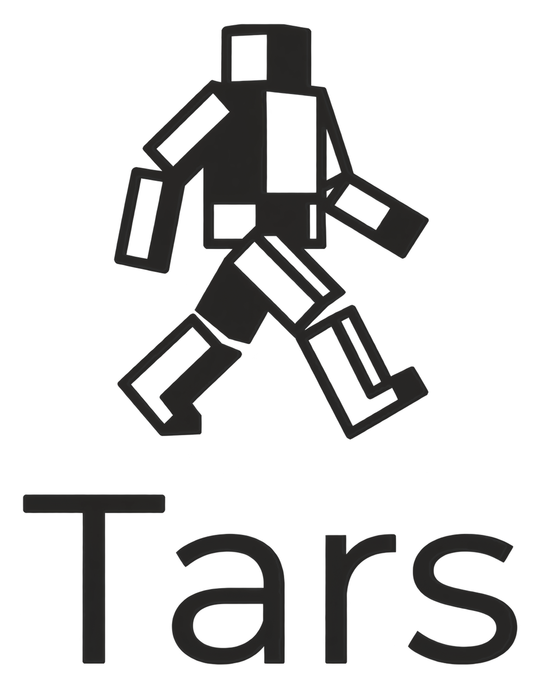

<h1 align="center">
  <picture>
    <source media="(prefers-color-scheme: dark)" srcset="docs/assets/tars-logo-transparent.png" />
    <source media="(prefers-color-scheme: light)" srcset="docs/assets/tars-logo-transparent-dark.png" />
    
  </picture>
</h1>

<p align="center">
  Experimental neural networks in Rust.<br />
  A Q8.24 affine-layer prototype in SystemVerilog.
</p>

<p align="center">
  <a href="#requirements">Getting started</a> &middot;
  <a href="#rust">Rust</a> &middot;
  <a href="#systemverilog">SystemVerilog</a> &middot;
  <a href="#documentation">Documentation</a>
</p>

---

`tars` is an experimental neural-network implementation written in Rust alongside a
SystemVerilog affine-layer prototype. The Rust code provides dense layers, ReLU and
sigmoid activations, sequential model composition, mean squared error, analytical and
finite-difference gradients, and batch gradient descent.

The Rust exporter writes Q8.24 weights, biases, activations, and targets under
`npu/data/`. The NPU testbench consumes the first three; model topology is not
exported, and results are not validated against the targets.

## Requirements

The Nix flake defines development shells for `x86_64-linux`:

```bash
nix develop             # Rust, NPU, Nix, and visualization tools
nix develop .#rust      # Rust and visualization tools
nix develop .#hardware  # Icarus Verilog, Verilator, GTKWave, and Verible
```

Without Nix, install a Rust 2024 toolchain and the system dependencies required by
`plotters`. Graphviz is required by the visualization prototype. The NPU commands
require GNU Make, Icarus Verilog, Verilator, and GTKWave as applicable.

## Rust

```bash
cargo build
cargo run --bin main
cargo run --bin visualization
cargo test
```

`main` runs the OR experiment selected in source, trains the model, prints its
predictions, and overwrites the four `.mem` files under `npu/data/`. There is no
runtime experiment selector, and the export does not contain model topology.

`visualization` writes `src/view/artifacts/graph.dot` and invokes Graphviz to create
`src/view/artifacts/network.png`. It renders its own hard-coded model rather than the
model trained by `main`.

The active Rust tests cover the PRNG and Xavier initialization. Tensor tests are
currently commented out.

## SystemVerilog

From `npu/`:

```bash
make sim
make wave
make lint
make clean
```

`make sim` compiles `src/pe.sv`, `src/npu.sv`, and `tests/tb.sv`, then prints the
result signals. The testbench does not assert expected results or read `target.mem`.
See [`npu/README.md`](npu/README.md) for the remaining targets and limitations.

## Documentation

See [`docs/README.md`](docs/README.md) for user documentation and navigation by task.

| Key Reference | Scope |
|---|---|
| [`docs/README.md`](docs/README.md) | User documentation entry point |
| [`docs/project/V0_CONTRACT.md`](docs/project/V0_CONTRACT.md) | v0.1.0 release target and acceptance criteria |
| [`docs/project/ROADMAP.md`](docs/project/ROADMAP.md) | Project milestones and ownership |
| [`docs/project/STATUS.md`](docs/project/STATUS.md) | Current implementation state and known limitations |
| [`AGENTS.md`](AGENTS.md) | Repository automation policy for AI tools |
